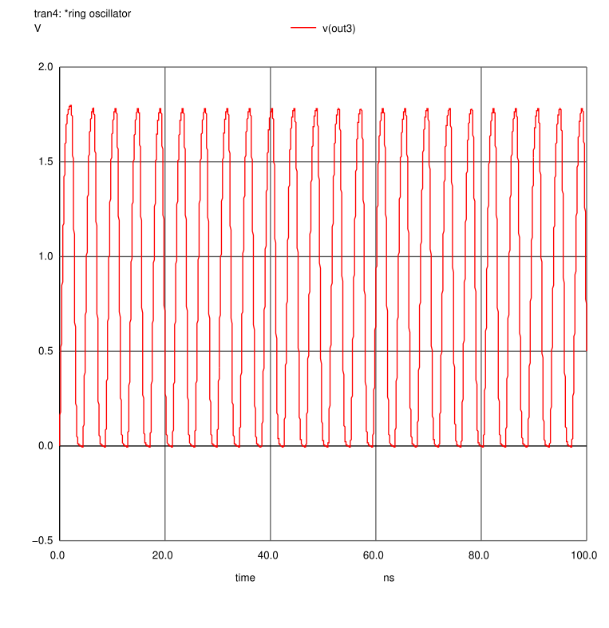

## 2.87 GHz Microwave Signal Generator

This project contains a 2.87 GHz fractional-N frequency synthesizer based microwave generator in skywater 130nm technology based on the publication cited below. 

```
A. S. Edakkadan, K. Saha, M. S. Baghini and A. Srivastava, "Design of 2.87 GHz Frequency Synthesizer with Programmable Sweep for Diamond Color Defect based CMOS Quantum Sensing Applications," 2022 IEEE International Symposium on Circuits and Systems (ISCAS), Austin, TX, USA, 2022, pp. 3092-3096, doi: 10.1109/ISCAS48785.2022.9937824.
```


This frequency synthersizer makes use of a phase locked loop to produce the output frequency. The PLL consists of a phase detector, charge pump, loop filter, varactor based 3 stage voltage controlled oscillator and multi-modulus divider.

## Project implementation
The figure below shows the block diagram for the 2.87 GHz fractional-N sythesizer implemented in skywater 130nm tecnology.  


### Simulation results
To validate our circuit, we have tested it in 180 nm technology and the results for the same are shown in the figure below.
#### Phase Frequency Detector

#### Voltage controlled Oscillator

#### Fractional-N divider

### Sources
This repository mainly contains all the required building blocks for the implementation of the PLL(gds/mag/netlists). We have the complete fractional-N PLL loop, individual blocks - PFD, fresctional-N divider, VCO, charge pump and loop filter. In addition to these we have combinations of phase dectector - divider and VCO - divider.  

## Publications

For use in publications or presentations please cite the original work mentioned above.


### DOCUMENTATION UNDER DEVELOPMENT
